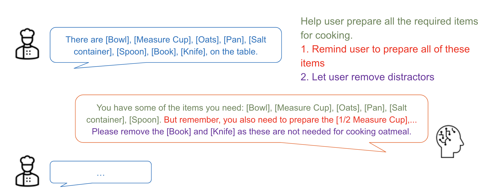

# Smart Kitchen


Group member:  Stephen Lamczyk, Yubo Rao, Ke Yang

#### Summary

Our demonstration, operating on an IoT device, achieves an impressive nearly 100 percent detection accuracy for all 11 required items and 5 distractors in real-time. This accomplishment is complemented by the playback of high-quality voice prompts generated by our Language Model Model (LLM). The seamless integration of detection capabilities and sophisticated voice prompts showcases the robustness and effectiveness of our system, highlighting its potential for practical application in real-world scenarios. There is a demo [video](https://drive.google.com/file/d/1aykLnRcrABxYUrV20N9WsVBGN4f_OEQX/view?usp=drive_link).

#### Task description

The goal of our project is to develop a system that can detect all the required items for making oatmeal, as well as a subset of the potential distractors. 

A list of all potential required items to create a serving of oatmeal include the following. It could be argued that the below list is far too comprehensive, but we decided it would be best to err on the side of caution and create a system that is potentially more capable than really needed rather than system that is potentially less capable than needed. It should be noted due to some conflicting information at the beginning of the project, only a subset of these were classes were originally collected. 

- Oatmeal
- Salt
- 1 Measure Cup
- 1/2 Measure Cup
- 1/4 Measure Spoon
- Pan
- Stirring Spoon
- Timer
- Bowl
- Metal Spoon
- Cork Hot Pad

The potential distractors that we chose include the following. We tried to chose distractor objects that make sense in a kitchen environment. These are typical household objects that have a reasonable potential to end up on a kitchen countertop. With this same reasoning, we did not use strange examples (such as lawnmower):

- Scissors
- Candy
- Knife
- Remote Control
- Sunscreen

#### Run

To run the code, make sure we have all the required packages installed and change the openai.api_key to your key.

And run

```bash
python3 run.py
```

#### Implementation

##### dataset

We started off by collecting objects in the required items  and distractors listed above. We took pictures of the required items using a Logitech 4K BRIO Webcam on a tripod approximately two feet above the items. Pictures of the distractors were collected using a typical smartphone camera. The consistent gray background was used as pictures of the required items were taken using a gray countertop as a background. In order to achieve this consistent gray background with the distractors and demos, a gray sheet was used. 200 pictures were taken of the required objects and 82 were taken of the distractor objects. We labeled them with Label Studio. The dataset can be download. [Required Items](https://drive.google.com/file/d/1rtFo1KAQLy7AqaDAKMnlFTKG9T3EDJtg/view?usp=drive_link), [Distractors](https://drive.google.com/file/d/18SGq0yEWHV27qXLHGcJM1OXXTiOm3gSg/view?usp=sharing).

##### training

YoloV8N was then trained on the the dataset.

In addition to just training the models on the dataset, some dataset augmentation was also introduced to artificially increase the variety of a relatively small dataset.

Specifically, we used Albumentations, which is built in to the YOLOV8 training framework, to augment our training data. The following series of augmentations were used to augment our training data. Each time an image is fed through the model for training, there is a 50% chance each of the following augmentations will be applied to the model before inference and backpropagation:

- Motion Blur
- Random Brightness and Contrast
- ISO Noise
- Contrast Limited Adaptive Histogram Equalization
- Flipping
- Random Shift Scale and Rotation

Despite the albumentation augmentations used, the rest of the model training parameters were kept to their defaults.



After we have the output of detection model, which is a list containing all the detected items, we need transfer it into text which will be fed into GPT4. Also, designed prompt is needed to tell GPT4 the task. The task have 2 parts. First, remind user to put required items on the table. Second, remind user to remove distractors. To accomplish these, we design the prompt for GPT like this. *"Answer questions to help user prepare all the required items for cooking. The required items are as follow: [1 Measure Cup], [1/2 Measure Cup], [1/4 Measure Cup], [Bowl], [Cork Hot Pad],  [Metal Spoon], [Oatmeal], [Pan], [Salt], [Stirring Spoon], [Timer]. Other items are distractors. You need remind user to prepare all of these items and let user remove distractors."* In the prompt we tell GPT4 both of the 2 tasks, and define the required items and distractors. 

